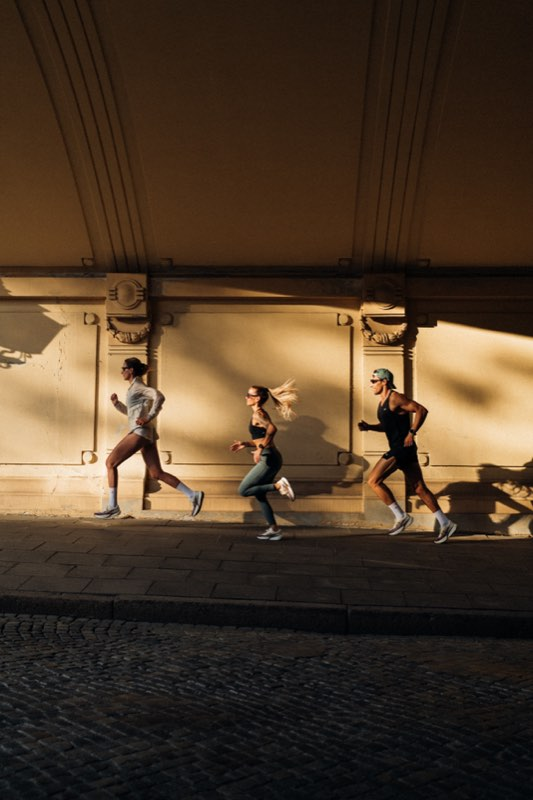

# polasobun.com — strona portfolio

Statyczna strona wizytówka / portfolio fotograficzne Poli Sobuń.
Dwa języki (PL / EN), galeria zdjęć, sekcja food, kontakt.

Strona jest **w pełni statyczna** — to zwykłe pliki HTML, CSS, JS i zdjęcia.
Nie ma bazy danych, nie ma panelu administracyjnego, nie ma nic do „uruchomienia".
Żeby cokolwiek zmienić, edytuje się pliki tekstowe i wgrywa je ponownie na serwer.

---

# CZĘŚĆ 1 — dla Poli (bez wiedzy technicznej)

## Jak obejrzeć stronę na swoim komputerze

Znajdź plik **`index.html`** w folderze strony i kliknij go dwa razy.
Otworzy się w przeglądarce i będzie działać tak samo jak w internecie —
łącznie z animacjami, galerią i przełącznikiem PL/EN.

Nic nie trzeba instalować. Nie trzeba mieć internetu (poza fontami — bez internetu
tekst będzie w zapasowym kroju pisma, reszta zadziała normalnie).

> **Uwaga:** zmiany w plikach widać dopiero po odświeżeniu strony (`Cmd + R`).
> Jeśli zmiana nie jest widoczna, odśwież z pominięciem pamięci podręcznej:
> `Cmd + Shift + R`.

## Jak podmienić zdjęcia

### Gdzie leżą zdjęcia

Wszystkie zdjęcia są w folderze `assets/img/`, w **dwóch kopiach każde**:

| Folder            | Do czego służy                          | Dłuższy bok |
|-------------------|------------------------------------------|-------------|
| `assets/img/lg/`  | duże kadry (hero, powiększenia, lightbox) | 1600 px     |
| `assets/img/sm/`  | miniatury w siatce galerii                | 800 px      |

Nazwy plików są sztywne i **muszą się zgadzać w obu folderach**:

- `work-00.jpg` … `work-47.jpg` — 48 zdjęć: moda, portret, sport, lifestyle
- `food-00.jpg` … `food-15.jpg` — 16 zdjęć: food i still life

Czyli `assets/img/lg/work-05.jpg` i `assets/img/sm/work-05.jpg` to **to samo zdjęcie**,
tylko w dwóch rozmiarach. Zawsze podmieniaj oba naraz.

### Jaki format i rozmiar

- format: **JPEG** (`.jpg`)
- orientacja: **pionowa, proporcje ok. 2:3** — cały layout jest pod to zaprojektowany.
  Zdjęcie poziome się „rozjedzie" i będzie wyglądać źle.
- zdjęcie źródłowe: im większe, tym lepiej — skrypt poniżej i tak je pomniejszy.

### Komenda do wygenerowania obu wariantów

Otwórz aplikację **Terminal** (Cmd + Spacja → wpisz „Terminal").
Wejdź do folderu ze stroną i uruchom komendę — podmień tylko dwie rzeczy:
ścieżkę do swojego zdjęcia i numer docelowy (`work-05`).

```bash
cd ~/Developer/polasobun-site

# 1. duża wersja (dłuższy bok 1600 px)
sips -Z 1600 -s format jpeg -s formatOptions 80 \
  ~/Desktop/moje-nowe-zdjecie.jpg \
  --out assets/img/lg/work-05.jpg

# 2. mała wersja (dłuższy bok 800 px)
sips -Z 800 -s format jpeg -s formatOptions 80 \
  ~/Desktop/moje-nowe-zdjecie.jpg \
  --out assets/img/sm/work-05.jpg
```

`sips` to narzędzie wbudowane w macOS — nie trzeba nic instalować.
Opcja `-Z` pilnuje proporcji, więc zdjęcie się nie zniekształci.

Sprawdź, jakie wymiary wyszły (przydadzą się w następnym kroku):

```bash
sips -g pixelWidth -g pixelHeight assets/img/lg/work-05.jpg
sips -g pixelWidth -g pixelHeight assets/img/sm/work-05.jpg
```

### Co poprawić w `index.html` po podmianie

Jeżeli podmieniasz zdjęcie **pod tą samą nazwą** (np. nowe `work-05.jpg` w miejsce starego)
i ma ono **te same proporcje** — nie musisz zmieniać nic w `index.html`. Gotowe.

Jeżeli wymiary się zmieniły, otwórz `index.html` w edytorze tekstu i znajdź linijkę
ze swoim zdjęciem (`Cmd + F` → wpisz `work-05`). Wygląda ona tak:

```html

```

Do poprawienia są trzy rzeczy:

| Atrybut            | Co wpisać |
|--------------------|-----------|
| `srcset` — liczby `533w` i `1066w` | **szerokości** (nie wysokości!) plików z `sm/` i `lg/`, z komendy powyżej |
| `width` i `height` | wymiary pliku z `lg/`. **Nie pomijaj ich** — bez nich strona „skacze" przy ładowaniu |
| `alt`              | opis zdjęcia dla osób niewidomych i Google — patrz niżej |

**Opisy zdjęć (`alt`)** nie są wpisywane wprost w `index.html`, bo muszą być w dwóch
językach. W `` jest tylko klucz — `data-i18n-alt="alt.w2"`. Sam tekst opisu
zmienia się w pliku `assets/js/app.js` (patrz sekcja niżej).

### Dodanie nowego zdjęcia do galerii

Trzeba dołożyć cały blok `` w `index.html` — najprościej skopiować sąsiedni
blok w siatce galerii i podmienić w nim numer zdjęcia oraz klucz `data-i18n-alt`.
To już jest praca dla osoby technicznej — patrz „Co warto dorobić".

## Jak zmienić teksty (PL i EN)

Wszystkie teksty strony siedzą w **jednym miejscu**: w pliku
**`assets/js/app.js`**, w słowniku na początku pliku. Wygląda on tak:

```js
var I18N = {
  en: {
    'nav.works': 'Works',
    'nav.about': 'About',
    'alt.w2':    'Fashion shoot — portrait in red',
    // ...
  },
  pl: {
    'nav.works': 'Prace',
    'nav.about': 'O mnie',
    'alt.w2':    'Sesja modowa — portret w czerwieni',
    // ...
  }
};
```

(Sekcja `en:` jest pierwsza, `pl:` druga — angielski jest językiem domyślnym.
Jeśli jakiegoś klucza brakuje w `pl`, strona pokaże wersję angielską zamiast pustego miejsca.)

Mechanizm jest prosty: w `index.html` element ma atrybut `data-i18n="nav.works"`,
a skrypt wstawia w niego tekst spod tego samego klucza z wybranego języka.

**Żeby zmienić istniejący tekst** — znajdź klucz i popraw tekst po prawej stronie.
Pamiętaj, żeby poprawić go **w obu językach**, `pl:` i `en:`.

**Żeby dodać nowy tekst:**

1. W `index.html` nadaj elementowi atrybut z nowym kluczem:
   ```html
   <p data-i18n="about.nagroda">…</p>
   ```
   (klucz to dowolna nazwa bez spacji; trzymaj konwencję `sekcja.nazwa`)
2. W `app.js` dopisz ten sam klucz w **obu** sekcjach:
   ```js
   pl: { "about.nagroda": "Nagroda Fotografii Roku 2025", },
   en: { "about.nagroda": "Photography Award of the Year 2025", },
   ```

Zasady, o których łatwo zapomnieć:

- klucz musi być **identyczny** w `index.html` i w `app.js` — wielkość liter ma znaczenie
- tekst wpisuj **w cudzysłowie**, a na końcu linii zostaw **przecinek**
- jeśli w tekście ma być cudzysłów, poprzedź go ukośnikiem: `\"`
- polskie znaki (`ń`, `ó`, `ł`, `ż`) są w porządku — plik jest w UTF-8

> Jeśli po zmianie strona przestanie działać (pusty ekran), to prawie na pewno
> brakujący przecinek albo cudzysłów. Cofnij zmianę i spróbuj jeszcze raz.

## Jak zmienić dane kontaktowe

Dane kontaktowe występują w **`index.html`** i trzeba je poprawić w dwóch miejscach naraz:
w tekście widocznym na stronie **i** w linku.

Otwórz `index.html`, użyj `Cmd + F` i szukaj obecnej wartości:

| Co zmieniasz | Czego szukać | Poprawić |
|---|---|---|
| e-mail  | `polasobun@gmail.com` | tekst na stronie **oraz** `href="mailto:polasobun@gmail.com"` |
| telefon | `883 180 410`         | tekst na stronie **oraz** `href="tel:+48883180410"` (bez spacji, z `+48`) |
| Instagram | `polasobun`         | tekst `@polasobun` **oraz** `href="https://www.instagram.com/polasobun/"` |

Sprawdź jeszcze sekcję `<script type="application/ld+json">` w nagłówku pliku —
tam adres Instagrama powtarza się raz jeszcze (to dane dla wyszukiwarki Google).

## Jak wdrożyć stronę do internetu

### Wariant A — Netlify (najprostszy, przeciągnij i upuść)

1. Wejdź na <https://app.netlify.com/drop>
2. Przeciągnij **cały folder** `polasobun-site` na stronę.
3. Poczekaj kilkanaście sekund — dostaniesz adres typu `losowa-nazwa.netlify.app`.
4. Żeby podpiąć własną domenę: *Site configuration → Domain management → Add a domain*,
   wpisz `polasobun.com` i postępuj wg instrukcji (trzeba zmienić DNS u rejestratora domeny).
5. Certyfikat HTTPS Netlify wystawia sam, za darmo.

Aktualizacja strony = ponowne przeciągnięcie folderu w to samo miejsce
(*Deploys → Drag and drop*).

Plik `netlify.toml` w folderze jest już skonfigurowany — Netlify sam go odczyta.

### Wariant B — Vercel

1. Zainstaluj narzędzie i wdróż:
   ```bash
   npm i -g vercel
   cd ~/Developer/polasobun-site
   vercel --prod
   ```
2. Przy pierwszym uruchomieniu Vercel zapyta o nazwę projektu.
   Na pytanie o *build command* i *output directory* — zostaw **puste**
   (to strona statyczna, nic się nie kompiluje).
3. Domenę podpina się w panelu: *Project → Settings → Domains*.

> Vercel **nie czyta** pliku `netlify.toml`. Żeby nagłówki bezpieczeństwa i cache
> działały też tam, trzeba dopisać plik `vercel.json` — patrz „Co warto dorobić".

### Wariant C — zwykły hosting FTP

1. Połącz się z serwerem programem **FileZilla** (darmowy) albo **Cyberduck**.
   Dane (host, login, hasło) dostajesz od firmy hostingowej.
2. Wejdź do katalogu strony na serwerze — zwykle `public_html/`, `htdocs/` albo `www/`.
3. Wgraj **zawartość** folderu `polasobun-site` (a nie sam folder!):
   `index.html`, `_headers` i cały katalog `assets/`.
   Plików `BRIEF.md`, `README.md` i `.gitignore` wgrywać nie trzeba.
4. Wejdź na `https://polasobun.com` — powinno działać od razu.

> Na zwykłym FTP **nie zadziała** `netlify.toml` ani `_headers` — to pliki
> konfiguracyjne konkretnych hostingów. Nagłówki bezpieczeństwa i cache trzeba
> wtedy ustawić w pliku `.htaccess` (Apache) lub w konfiguracji nginx.
> Strona będzie działać poprawnie bez tego, tylko mniej optymalnie.

---

# CZĘŚĆ 2 — dla developera

## Stack

Zero build-stepu, zero npm, zero frameworka. Trzy pliki źródłowe:

```
index.html            — cała treść i struktura, atrybuty data-i18n
assets/css/style.css  — cały arkusz stylów
assets/js/app.js      — słownik i18n + animacje (smooth scroll, marquee, lightbox)
```

Jedyna zewnętrzna zależność: **Google Fonts (Archivo)**. Żadnych CDN-ów z JS —
smooth scroll, marquee i reveal-e są napisane ręcznie na `requestAnimationFrame`
i `IntersectionObserver`.

Wymóg twardy: `index.html` otwarty z `file://` musi działać. Dlatego słownik i18n
jest **w JS**, a nie w JSON-ie ładowanym `fetch`-em (`file://` to zablokuje).

## Warstwa okołoprojektowa (ten commit)

| Plik | Rola |
|---|---|
| `assets/favicon.svg` | monogram `PS`, jasne litery na `#0A0A0A`, viewBox 64×64, litery jako ścieżki (bez zależności od fontu) |
| `assets/favicon-dark.svg` | wariant odwrócony — ciemne litery na `#EDEDE8` |
| `assets/og.jpg` | karta Open Graph 1200×630, wygenerowana z `assets/img/lg/work-20.jpg` |
| `netlify.toml` | publish dir `.`, nagłówki bezpieczeństwa, CSP, cache |
| `_headers` | to samo dla Netlify/Cloudflare Pages w formacie `_headers` |
| `.gitignore` | `.DS_Store`, `node_modules/`, `*.log`, `.vscode/` |

### Favicon — wpięcie wariantu dark

`index.html` linkuje obecnie tylko wersję podstawową:

```html
<link rel="icon" href="assets/favicon.svg" type="image/svg+xml">
```

Żeby ikona reagowała na motyw systemowy, zastąp to parą:

```html
<link rel="icon" href="assets/favicon.svg" type="image/svg+xml"
      media="(prefers-color-scheme: light)">
<link rel="icon" href="assets/favicon-dark.svg" type="image/svg+xml"
      media="(prefers-color-scheme: dark)">
```

Wsparcie dla `media` na `<link rel=icon>` jest nierówne (Safari ignoruje).
Alternatywa dająca ten sam efekt wszędzie: wstawić `@media (prefers-color-scheme: dark)`
**wewnątrz** samego SVG i zostawić jeden link.

### Regeneracja `og.jpg`

Źródło jest pionowe 2:3, karta OG pozioma 1.91:1, więc kadr jest wymuszony:
skalujemy do szerokości 1200 i wycinamy 630 px zaczynając od `y = 260`
(kadr od klatki piersiowej w górę, z zapasem nad głową).
`--cropOffset` w `sips` liczy się **od lewego górnego rogu**, nie od środka.

```bash
cd ~/Developer/polasobun-site
SRC=assets/img/lg/work-20.jpg

sips --resampleWidth 1200 "$SRC" --out /tmp/og-scaled.jpg
sips -c 630 1200 --cropOffset 260 0 /tmp/og-scaled.jpg --out /tmp/og-crop.jpg
sips -s format jpeg -s formatOptions 75 /tmp/og-crop.jpg --out assets/og.jpg

sips -g pixelWidth -g pixelHeight assets/og.jpg   # kontrola: 1200 × 630
```

Przy zmianie zdjęcia źródłowego offset `260` trzeba dobrać na oko —
zbyt duży utnie głowę, zbyt mały da sam kadr tła.

### CSP — świadomy kompromis

```
script-src 'self' 'unsafe-inline'
```

`'unsafe-inline'` jest tu potrzebne z powodu inline'owego bloku
`<script type="application/ld+json">` (JSON-LD dla Google) oraz ewentualnego
inline bootstrapu języka. Docelowo można to zacieśnić hashami SHA-256 każdego
inline'owego bloku — przy statycznym HTML-u bez formularzy i bez treści od
użytkownika ryzyko XSS jest bliskie zeru, więc to nie jest pilne.

`style-src` ma `'unsafe-inline'` na stałe — krytyczny CSS w `<head>` oraz
`el.style.transform` ustawiane z JS (smooth scroll, parallax) tego wymagają.

Google Fonts wymaga **obu** hostów, inaczej fonty nie wstaną:
`fonts.googleapis.com` w `style-src` (arkusz CSS) i `fonts.gstatic.com`
w `font-src` (pliki `.woff2`). To najczęstszy błąd przy pisaniu CSP.

### CSP a `BRIEF-V2.md` — do zrobienia przy sekcji MOTION

`BRIEF-V2.md` planuje sekcję **MOTION** z oficjalnym embedem rolek Instagrama
(`https://www.instagram.com/embed.js`). **Obecna CSP celowo tego nie dopuszcza** —
w kodzie nie ma jeszcze żadnego embeda, a CSP odzwierciedla faktyczny stan strony.

W momencie, w którym embed faktycznie wejdzie do `index.html`, CSP w **obu** plikach
(`netlify.toml` i `_headers`) trzeba rozszerzyć, inaczej sekcja nie ruszy na produkcji:

```
script-src  … https://www.instagram.com https://*.cdninstagram.com
frame-src   https://www.instagram.com
img-src     'self' data: https://*.cdninstagram.com https://*.fbcdn.net
connect-src 'self' https://www.instagram.com https://*.cdninstagram.com
```

To jest **rozluźnienie polityki bezpieczeństwa** — dopuszcza wykonywanie skryptów
z zewnętrznego hosta. Warto to zrobić świadomie i dopiero wtedy, gdy embed jest
naprawdę potrzebny. Fallback opisany w `BRIEF-V2.md` (podmiana na statyczną kartę,
gdy embed nie wstanie w 3 s) jest tu obowiązkowy — adblockery blokują `embed.js`
niezależnie od CSP.

## Znane niespójności do wyprostowania

- **`canonical` vs `sitemap.xml` — ROZWIĄZANE.** Ten prototyp w korzeniu
  miał `index.html` deklarujący
  `<link rel="canonical" href="https://polasobun.com/">` (bez `www`),
  podczas gdy stare `robots.txt` i `sitemap.xml` w korzeniu wskazywały
  `https://www.polasobun.com/` — niespójność między dwoma ręcznie
  utrzymywanymi źródłami prawdy. Oba pliki zostały usunięte z korzenia;
  produkcyjna strona to teraz projekt Astro w `polasobun/`, gdzie
  sitemapa i robots.txt są generowane, nie ręcznie pisane, i liczą się
  z tej samej wartości `site` co `canonical` — patrz
  `polasobun/src/pages/sitemap.xml.ts`, `polasobun/src/pages/robots.txt.ts`
  oraz `canonical` w `polasobun/src/layouts/Base.astro`. Rozbieżności
  między nimi nie da się już popełnić przez przeoczenie.

## Co warto dorobić

- **Brak CMS.** Każda zmiana treści i zdjęcia to ręczna edycja pliku i ponowny
  deploy. Przy częstszych aktualizacjach sensowny byłby Netlify CMS / Decap CMS
  (działa na plikach w repo, bez backendu) albo najprostszy headless typu Sanity.
- **Galeria jest wpisana ręcznie w HTML.** `assets/img/manifest.json` zawiera
  wymiary wszystkich 64 plików, ale nic go nie czyta — `` z `width`/`height`/
  `srcset` są wypisane w `index.html` jeden po drugim. Dodanie zdjęcia = ręczne
  dopisanie bloku i klucza `alt` w dwóch językach. Warto dorobić skrypt
  generujący te bloki z manifestu.
- **Brak WebP/AVIF.** Same JPEG-i. `<picture>` z AVIF dałoby 30–50 % mniej
  transferu przy tej samej jakości; generowalne z `cwebp`/`avifenc`.
- **Brak `vercel.json`.** Przy deployu na Vercel nagłówki z `netlify.toml`
  i `_headers` są ignorowane — trzeba je zduplikować w `vercel.json`.
- **Brak wersjonowania zasobów.** `style.css` i `app.js` nie mają hasha w nazwie,
  stąd ostrożny `max-age=3600` zamiast `immutable`. Hash w nazwie pliku
  (albo `?v=2`) pozwoliłby cache'ować je na rok.
- **Brak testów i CI.** Minimum: Lighthouse CI na PR i walidator HTML.
- **`favicon.ico`** dla bardzo starych przeglądarek — obecnie tylko SVG.
- **Brak strony 404.** Netlify pokaże własną; warto dorobić `404.html` w stylu strony.
